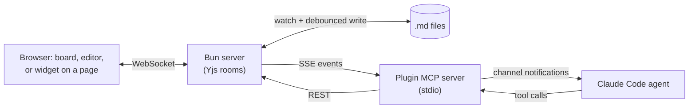

# Claude Workspaces Plugin v0.2.0

## Warning

This is a personal Claude Code harness that works nicely for one person (@fryanpan) to move fast on many lower risk projects in parallel (think 6+ projects, each with multiple subagents running in parallel).

I would recommend steering clear for most people.  Go use more polished tools.  There's a good chance that the workflows you find here will be more broadly available in other tools in a few months.  Many folks seem to be hitting similar limitations and exploring a similar solution space (e.g. see [Nimbalyst for Teams](https://nimbalyst.com/teams/)).

With that said, please take a look and poke around.  Feel free to borrow parts that look useful!

## What's The Workspace Plugin For?

I've been [working with a team of agents from my phone](https://fryanpan.com/posts/agent-team/) (and Mac Mini) for most of this year.  As I've started more projects in parallel, I've regularly felt the pain of trying to keep up with  as the user interface.

Since late Spring 2026, the original foundations in this repo made it easy to collaboratively edit all these artifacts with Claude Code:

- **Markdown docs** with Mermaid diagrams (like Markdown artifacts in Claude Desktop)
- **Mockups** of web or mobile interfaces (like Claude Design)
- **Live dev servers** or staging applications
- **Folder diffs** from a git repo

This has proven useful so far, but as the fleet of agents has grown, other bottlenecks have come up.

## Current Experiments

Here are some of the main bottlenecks this repo tries to tackle.

### 1. Increase productivity by focusing on key decisions that need a human, not chat

A stream of chat messages is hard to work with, especially if 15+ agents are talking to you.

Instead the workspace lets me do the following:

1. **Weekly Priorities**: Set up priorities each week across projects and within projects
2. **Focus on Review Items**: Any time an agent needs help, from anywhere, they can give me a *review item* (e.g. a multiple choice question, a document to look at, a mockup, a request for me to do a human step). Each **review item** tries to clearly and briefly hold just enough information to make a human decision.
3. **Primary Work Surface = Review Queue, Not Chat**: Whenever I have a moment, I go through review items that agents have already sorted in priority order for the week. This can be from anywhere -- at home, or on the go from my phone or iPad.

All status updates and other chatter stream somewhere else, where I can summarize them if needed.

### 2. Reduce overhead between humans and agents by having a shared space designed for all of us

In SaaS tools, I had to deal with a UX that was built for the masses but not for me and MCPs that are often fragile and missing key functionality.  And if I wanted to try out some new way to work, it's hard to extend legacy SaaS tools and cobble things together.

For now, I decided to ditch all the SaaS tools, and now I do all of the following in this workspace plugin:

- **Working with docs**: Notion / Confluence
- **Meetings**: Granola / Fireflies.ai
- **Product and project management**: Asana / Jira / Linear
- **UX Design**: Figma / Claude Design (but I'd already switched to doing this mostly in Claude Code earlier this year)

Each part of the workspace supports real-time collaboration, so my agents and I all see the same thing.  Plus agents can reach me from anywhere with a review item.  And I can reach my Claude Code agent also from anywhere with comments and voice feedback via [Claude Code channels](https://code.claude.com/docs/en/channels).

This has reduced my communication overhead a lot.

### 3. Better guardrails to keep team on track for hours to days

On long projects, agents tended to go off track, stop early, or sit silently waiting on me. A few guardrails keep them moving:

- **Continuous reprioritization**: Agents continuously reprioritize tasks according to high level goals I've set
- **Done criteria** on each task that a separate agent verifies
- **Stall check** that pings agents to tell them to keep going if they're not done yet
- **Scheduled tasks**: Slightly more reliable and flexible than the default scheduled tasks in Claude Code (and the tasks can have done criteria)

Experiments 1, 2 and 3 together have roughly doubled my productivity from ~10x 2024 levels to ~20x since August 2026.

### 4. Voice Everywhere

This repo lets me experiment with more advanced voice functionality than SaaS services support (or can afford to support)

- e.g. Real-time note taking and reorganization while I can also edit the same notes
- e.g. Giving voice feedback on a mockup or live web app, where the agent segments topics automatically, cleans up feedback notes, and attaches each feedback item to the right element on screen

### 5. Sharing a board with collaborators (unproven)

This functionality still needs more security hardening before trying it out for real.  I've only used it briefly with my life partner.

Experiments 4 and 5 are still in early testing -- who knows if they're actually useful?

## Install

You need [Claude Code](https://code.claude.com/docs), [Bun](https://bun.sh) and git. These steps were last tested end to end from a fresh clone on macOS on 30 September 2026, with plugin 0.1.275. Linux and Windows are untested.

**Fastest path:** clone the repo (step 3), open Claude Code inside the clone and run `/setup`. It walks through the steps below, asks before each one that changes your machine, and turns on the leak-gate git hooks.

The **plugin** comes from the Claude Code plugin marketplace and carries the MCP tools, hooks and skills. The **server** runs from a clone of this repo and writes `~/.claude/claude-workspaces/server.json` when it starts, which is how the plugin finds it.

### 1. Install the plugin

```sh
claude plugin marketplace add fryanpan/claude-workspaces-plugin
claude plugin install claude-workspaces@claude-workspaces --scope user
```

This registers the repo as a marketplace and installs the plugin for every session.

### 2. Launch Claude Code with channels turned on

The server pushes comments and task changes into your session as channel events, which Claude Code accepts only from a plugin named at launch:

```sh
claude --dangerously-load-development-channels plugin:claude-workspaces@claude-workspaces
```

To make that the default, add a shell function to `~/.zshrc` or `~/.bashrc`, with the path from `command -v claude`:

```sh
claude() { /path/to/claude --dangerously-load-development-channels plugin:claude-workspaces@claude-workspaces "$@"; }
```

Without the flag the tools still work, but the agent sees a comment only when it asks for one. The flag is the development form because this plugin is not on Anthropic's approved channel list. The flag does not appear in `claude --help` during the channels research preview.

To update the plugin later, then restart your sessions:

```sh
command claude plugin marketplace update claude-workspaces
command claude plugin update claude-workspaces@claude-workspaces
```

`command claude` skips the shell function above, whose extra flag breaks the `plugin` subcommands.

Name each session at launch, for example `CW_AGENT_NAME="Docs agent" claude`. Tasks the agent files are owned by that name; without one, the server refuses a task that names no owner.

On a claude.ai Team or Enterprise plan, channels stay off until an organization Owner enables them in the Claude Code admin settings. The tools work either way ([channels docs](https://code.claude.com/docs/en/channels#enterprise-controls)).

### 3. Run the server

```sh
git clone https://github.com/fryanpan/claude-workspaces-plugin.git
cd claude-workspaces-plugin
bun install
CW_REQUIRE_SIGNIN_TO_WRITE=0 bun run dev --host 127.0.0.1
```

`bun run dev` starts the server with hot reload and prints its addresses. Keep the terminal open.

- `--host 127.0.0.1` keeps the server on this machine. Without it the server listens on every network interface.
- `CW_REQUIRE_SIGNIN_TO_WRITE=0` lets your own browser comment and edit. By default a browser must sign in to write, and a server reached at `localhost` has no sign-in page, so the board opens read-only.
- `--port <n>` picks the port. The default is 8787; if it is taken, the server moves to the next free port.
- `CW_DATA_DIR=<path>` picks where data goes. The default is `data/` in the clone.

With `--host 127.0.0.1`, only a browser on the same machine can open the board; the Tailscale and LAN addresses the server prints do not answer. To review from a tablet or phone on your network, start it without `--host` and with the rule off:

```sh
CW_ACCESS_ONLY_BROWSER_HOSTS=0 bun run dev
```

**Do not add `CW_REQUIRE_SIGNIN_TO_WRITE=0` to this command.** Keep the sign-in gate on, or anything on your network can write to your boards and docs. Turning the rule off also turns on emailed-code sign-in; until `AUTH_EMAIL_FROM` is set, the code is printed in the server's terminal. This path is untested from a fresh clone. [security.md](docs/architecture/security.md) explains what the rule protects.

### 4. Open the board

Open the `localhost` address the server printed, for example `http://localhost:8787/`. Then, in a session launched as in step 2, ask things like:

- "Create a workspace for this project and file what we just discussed as tasks."
- "Show me the dev server in a workspace."

## Keep the server running (macOS, optional)

Untested from a fresh clone.

`bun run dev` stops when its terminal closes. To keep the server up across logout, reboot and crashes, install a per-user launchd service from the clone:

```sh
./scripts/launchd/install.sh
```

It starts the service on port 8787, logs to `~/Library/Logs/`, and serves a one-time build with no hot reload. It is safe to run twice. To remove it:

```sh
./scripts/launchd/uninstall.sh
```

If the clone is on a volume other than the boot disk, give the launchd copy of `bun` Full Disk Access first (System Settings, Privacy & Security, Full Disk Access). `install.sh` says so when it sees the symptom: empty logs and no listener.

HTTPS on a tailnet, which the microphone needs on any device other than the host, is in [tailnet-https.md](docs/process/tailnet-https.md). Also untested from a fresh clone.

## How it works

- **Push, not polling.** Comments, review answers and new tasks reach the agent as `<channel source="claude-workspaces" ...>` events through [Claude Code channels](https://code.claude.com/docs/en/channels).
- **Anchored comments.** Docs are Yjs CRDTs; a comment anchored to text or to a page element moves with concurrent edits.



It is not hosted: the server runs on your machine. It does not replace pull-request review on GitHub.

## Status

Beta: one person's agent teams use it daily. Expect sharp edges.

- A markdown file under review is **bound**: it and its live doc sync both ways. Edit it through the plugin's tools, not with a plain editor save that races the write-back.
- Untested from a fresh clone: Linux and Windows, the local-network setup, the launchd service, HTTPS on a tailnet, the Recall.ai meeting bot, and publishing a board through Cloudflare Access.

## Contributing

Run `git config core.hooksPath .githooks` once after cloning to turn on the leak gates that keep private names and keys out of this public repo. `bun run verify` runs every check CI runs. Start at [CLAUDE.md](CLAUDE.md) and [docs/architecture/overview.md](docs/architecture/overview.md).

## License

[MIT](LICENSE)
