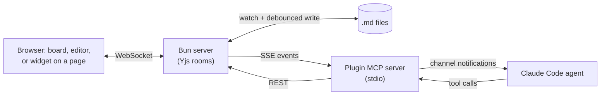

# Claude Workspaces

**The goal is to make it easier to work with teams of agent teams:** to help the team stay on track, working on what's valuable.  And to continue to have a platform to test out new workflows and ideas that are not common practice yet.

If you run multiple Claude Code sessions at once, each one likely spinning up subagents and workflows, this gives you one place to coordinate a whole fleet, from wherever you are (at home or on the go).

## Current Experiments

### 1. Increase productivity by focusing on prioritized decisions that need a human, not chat

A stream of status updates and questions gets hard to manage with a growing fleet.

Instead, the workspace lets you set up weekly priorities across multiple projects.  And then any time an agent needs help, from anywhere, it can attach a **review item** to your queue.  Each review item tries to briefly summarize what you need to know to make the decision.  And it can link to real-time collaborative docs, mockups, dev servers.

You primarily make human decisions on review items, in a single queue, in priority order across all projects.  This cuts out the lower priority status updates and keeps decisions organized yet asynchronous.

It's helped me get 80-90% of my interactions each week out of chat, and mainly into reviewing.  And early data shows this is likely one of the main changes that's doubled my productivity in Aug/Sep 2026 (from about 10x 2024 levels to about 20x).

### 2. Real-time multiplayer, to make it easier for people + agents to stay on the same page

Working with legacy SaaS tools today and trying to integrate across them is hard sometimes for both agents and humans.  Tools like Asana and Notion cover much of the same space as this tool, but then you're in their walled garden and stuck when you can't do something.

Everyone seems to be trying to get your data and work in their garden, to build some moat.  This repo is an experiment to instead go [local-first](https://www.inkandswitch.com/local-first-software/) and make all SaaS tools secondary (except keeping Claude Code at the core).

Most work takes place here in the workspace, with good agent and human UX, and real-time multiplayer collaboration, instead of in SaaS tools:

- **Working with docs**: Notion / Confluence
- **Meetings**: Granola / Fireflies.ai
- **Product and project management**: Asana / Jira / Linear
- **UX Design**: Figma / Claude Design
- **Team tracking & retrospectives**: Timely (using weekly-review tools which are still private)

All of the pieces are integrated, agents can surface decisions (see #1) from anywhere while they work, and conversely, I can reach Claude Code from anywhere in the workspace immediately via [Claude Code channels](https://code.claude.com/docs/en/channels).

This has been a joy -- I don't have to deal with the latency, fragility and missing functionality in MCPs.  I can just work, and when there's a problem, the most rewarding thing is I can have one of my project agents express requirements back to the workspace agent.  And then minutes later, there's a new feature or bug fix -- I can't do this with other SaaS software.

### 3. Deterministic guardrails to give longer projects a higher chance of success

Claude Code already gives us tools like `/goal` and `/workflow` to try and get to a goal; but on more loosely specified tasks, agents often quit early or reward hack (find incorrect solutions that look like they reach the goal).

This harness provides a few tools that keep the fleet moving:

- **Stall check**: If an active task is not making progress, and not waiting for a human decision, the stall check periodically asks the agent what's up.
- **Done criteria** on each task. Agents must convince an independent judge agent that the done criteria are met. This is similar to how `/workflow` requires a subtask to report output in a specific JSON schema.
- **Scheduled tasks**: Similar to what's already in Claude Code, except these reliably come back after session restart and look just like other tasks (have done criteria, can surface review items, etc.)

### 4. Voice everywhere to reduce friction

Testing out using voice interfaces pervasively to see where/if this might help save time.

It's been fun being able to do all of the following:

- Have notes taken live that I can edit at the same time to help me run more effective meetings
- Give feedback about a mockup by just talking, and having agents split up my feedback into topics and attach comments to the right element on the page. In parallel, my Claude Code is working in the background to update the mock within 1-2 minutes
- Doing the same thing on a live production site (personal tool) is also fun

### 5. Sharing a board with collaborators (unproven)

This functionality still needs more security hardening before using for real.

## What else it does

All of the things this tool used to help with still form the foundation.  You can still review, edit, and comment on each of the following together, in real-time with agents:

- **Markdown docs** with Mermaid diagrams and MDX components (e.g. charts)
- **Mockups** of web or mobile interfaces
- **Live dev servers** or staging applications
- **Folder diffs** from a git repo

## Install

You need [Claude Code](https://code.claude.com/docs), [Bun](https://bun.sh) and git. These steps were last tested end to end from a fresh clone on macOS on 30 September 2026, with plugin 0.1.275. Linux and Windows are untested.

**Fastest path:** clone the repo (step 3), open Claude Code inside the clone and run `/setup`. It walks through the steps below, asks before each one that changes your machine, and turns on the leak-gate git hooks.

The **plugin** comes from the Claude Code plugin marketplace and carries the MCP tools, hooks and skills. The **server** runs from a clone of this repo and writes `~/.claude/claude-workspaces/server.json` when it starts, which is how the plugin finds it.

### 1. Install the plugin

```sh
claude plugin marketplace add fryanpan/claude-workspaces-plugin
claude plugin install claude-workspaces@claude-workspaces --scope user
```

This registers the repo as a marketplace and installs the plugin for every session.

### 2. Launch Claude Code with channels turned on

The server pushes comments and task changes into your session as channel events, which Claude Code accepts only from a plugin named at launch:

```sh
claude --dangerously-load-development-channels plugin:claude-workspaces@claude-workspaces
```

To make that the default, add a shell function to `~/.zshrc` or `~/.bashrc`, with the path from `command -v claude`:

```sh
claude() { /path/to/claude --dangerously-load-development-channels plugin:claude-workspaces@claude-workspaces "$@"; }
```

Without the flag the tools still work, but the agent sees a comment only when it asks for one. The flag is the development form because this plugin is not on Anthropic's approved channel list. The flag does not appear in `claude --help` during the channels research preview.

To update the plugin later, then restart your sessions:

```sh
command claude plugin marketplace update claude-workspaces
command claude plugin update claude-workspaces@claude-workspaces
```

`command claude` skips the shell function above, whose extra flag breaks the `plugin` subcommands.

Name each session at launch, for example `CW_AGENT_NAME="Docs agent" claude`. Tasks the agent files are owned by that name; without one, the server refuses a task that names no owner.

On a claude.ai Team or Enterprise plan, channels stay off until an organization Owner enables them in the Claude Code admin settings. The tools work either way ([channels docs](https://code.claude.com/docs/en/channels#enterprise-controls)).

### 3. Run the server

```sh
git clone https://github.com/fryanpan/claude-workspaces-plugin.git
cd claude-workspaces-plugin
bun install
CW_REQUIRE_SIGNIN_TO_WRITE=0 bun run dev --host 127.0.0.1
```

`bun run dev` starts the server with hot reload and prints its addresses. Keep the terminal open.

- `--host 127.0.0.1` keeps the server on this machine. Without it the server listens on every network interface.
- `CW_REQUIRE_SIGNIN_TO_WRITE=0` lets your own browser comment and edit. By default a browser must sign in to write, and a server reached at `localhost` has no sign-in page, so the board opens read-only.
- `--port <n>` picks the port. The default is 8787; if it is taken, the server moves to the next free port.
- `CW_DATA_DIR=<path>` picks where data goes. The default is `data/` in the clone.

With `--host 127.0.0.1`, only a browser on the same machine can open the board; the Tailscale and LAN addresses the server prints do not answer. To review from a tablet or phone on your network, start it without `--host` and with the rule off:

```sh
CW_ACCESS_ONLY_BROWSER_HOSTS=0 bun run dev
```

**Do not add `CW_REQUIRE_SIGNIN_TO_WRITE=0` to this command.** Keep the sign-in gate on, or anything on your network can write to your boards and docs. Turning the rule off also turns on emailed-code sign-in; until `AUTH_EMAIL_FROM` is set, the code is printed in the server's terminal. This path is untested from a fresh clone. [security.md](docs/architecture/security.md) explains what the rule protects.

### 4. Open the board

Open the `localhost` address the server printed, for example `http://localhost:8787/`. Then, in a session launched as in step 2, ask things like:

- "Create a workspace for this project and file what we just discussed as tasks."
- "Show me the dev server in a workspace."

## Keep the server running (macOS, optional)

Untested from a fresh clone.

`bun run dev` stops when its terminal closes. To keep the server up across logout, reboot and crashes, install a per-user launchd service from the clone:

```sh
./scripts/launchd/install.sh
```

It starts the service on port 8787, logs to `~/Library/Logs/`, and serves a one-time build with no hot reload. It is safe to run twice. To remove it:

```sh
./scripts/launchd/uninstall.sh
```

If the clone is on a volume other than the boot disk, give the launchd copy of `bun` Full Disk Access first (System Settings, Privacy & Security, Full Disk Access). `install.sh` says so when it sees the symptom: empty logs and no listener.

HTTPS on a tailnet, which the microphone needs on any device other than the host, is in [tailnet-https.md](docs/process/tailnet-https.md). Also untested from a fresh clone.

## How it works

- **Push, not polling.** Comments, review answers and new tasks reach the agent as `<channel source="claude-workspaces" ...>` events through [Claude Code channels](https://code.claude.com/docs/en/channels).
- **Anchored comments.** Docs are Yjs CRDTs; a comment anchored to text or to a page element moves with concurrent edits.



It is not hosted: the server runs on your machine. It does not replace pull-request review on GitHub.

## Status

Beta: one person's agent teams use it daily. Expect sharp edges.

- A markdown file under review is **bound**: it and its live doc sync both ways. Edit it through the plugin's tools, not with a plain editor save that races the write-back.
- Untested from a fresh clone: Linux and Windows, the local-network setup, the launchd service, HTTPS on a tailnet, the Recall.ai meeting bot, and publishing a board through Cloudflare Access.

## Contributing

Run `git config core.hooksPath .githooks` once after cloning to turn on the leak gates that keep private names and keys out of this public repo. `bun run verify` runs every check CI runs. Start at [CLAUDE.md](CLAUDE.md) and [docs/architecture/overview.md](docs/architecture/overview.md).

## License

[MIT](LICENSE)
